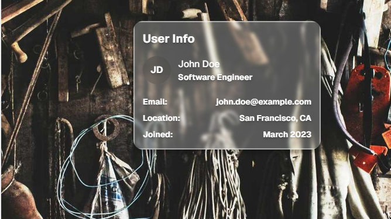

# APPLE WWDC  2025 Liquid Glass Effect Vue 3

Card Example              |  Button Example
:-------------------------:|:-------------------------:
  |  

## Installation

```bash
npm install liquid-glass-vue3
```
## Usage

### Global Import

```javascript
// main.js
import { createApp } from 'vue'
import App from './App.vue'
import LiquidGlassPlugin from 'liquid-glass-vue3'

const app = createApp(App)
app.use(LiquidGlassPlugin)
app.mount('#app')
```

### Individual Import

```javascript
// Dans votre composant
import { LiquidGlass } from 'liquid-glass-vue3'

export default {
  components: {
    LiquidGlass
  }
}
```

### Usage with TypeScript

```typescript
import { LiquidGlass } from 'liquid-glass-vue3'
import type { LiquidGlassProps } from 'liquid-glass-vue3'
```

## Usage Examples

### Basic Usage

```vue
<template>
  <LiquidGlass>
    <p>Content with liquid glass effect</p>
  </LiquidGlass>
</template>
```

## Props

| Prop | Type | Défaut | Description |
|------|------|--------|-------------|
| `tag` | `String` | `'div'` | Élément HTML à utiliser |
| `tintColor` | `String` | `'rgba(255, 255, 255, 0.25)'` | Couleur de teinte du verre |
| `backdropBlur` | `String` | `'3px'` | Intensité du flou d'arrière-plan |
| `hoverEffect` | `Boolean` | `true` | Active les effets de survol |
| `textColor` | `String` | `'black'` | Couleur du texte |
| `turbulenceFrequency` | `String` | `'0.01 0.01'` | Fréquence de la turbulence SVG |
| `turbulenceSeed` | `Number` | `5` | Graine de la turbulence |
| `blurIntensity` | `Number` | `3` | Intensité du flou |
| `surfaceScale` | `Number` | `5` | Échelle de la surface |
| `displacementScale` | `Number` | `150` | Échelle du déplacement |
| `customStyles` | `Object` | `{}` | Styles CSS personnalisés |


## Support des navigateurs

Ce composant utilise des fonctionnalités CSS modernes :
- `backdrop-filter` (pour l'effet de flou)
- Filtres SVG
- Variables CSS

Assurez-vous que vos navigateurs cibles supportent ces fonctionnalités.

## Développement

```bash
# Installer les dépendances
npm install

# Développement
npm run dev

# Build
npm run build

# Génération des types
npm run build:types
```

## License

MIT